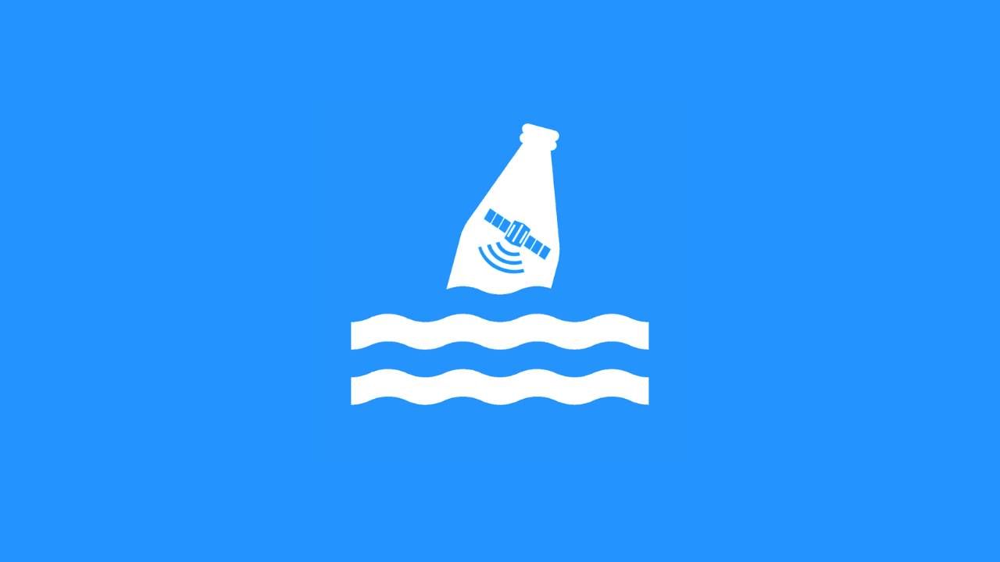

<h1 align="center">Messages in Bottles</h1>

  
  
  
  
  

> Messages in Bottles is an online platform containing interactive visualizations and information on coastal plastic waste using remote sensing data from Sentinel-2. The authors created the project during the 2020 NASA International Space Apps Challenge, which won in the Manila region and went on to become one of the global nominees.

  

## 🚀 Challenge

There is concern worldwide that environmental issues we face today will have an impact on future generations. Your challenge is to create a way to communicate the importance of environmental responsibility to people of all ages.

## 📚 Abstract

One of the biggest threats to the world's oceans is plastic waste which is primarily found in coastal areas with abundant human activity. Plastic waste destroys biodiversity and is well known to stay undegraded for long periods of time, making it toxic to aquatic life and people. While this is a significant environmental issue, the data is often scattered and difficult to understand for the general public which leads to this problem being downplayed. Research has delved deeply into this with recent breakthroughs in tracking coastal plastic waste through remote sensing, but there is a gap between this and the general public. Our solution aims to bridge that with an online platform that visualizes satellite data and research-based information on plastic waste in coastal waters.

One of the biggest threats to the world's oceans is plastic waste associated with human activity in coastal areas. Plastic waste destroys biodiversity and persists in the ecosystem for centuries, making it toxic to aquatic life and people. While this is a significant issue, related data is often scattered and difficult to understand for non-specialists, which leads to the issue being downplayed. Recent breakthroughs in tracking coastal plastic waste through remote sensing have been made, but it is not effectively communicated to the public. Our solution aims to bridge that with an online platform that visualizes satellite data and research on plastic waste in coastal waters.

**Project Page:** [https://2020.spaceappschallenge.org/challenges/sustain/](https://2020.spaceappschallenge.org/challenges/sustain/sustaining-our-planet-future-generations/teams/manila-bay-sands/project)

## 💡 Solution

Messages in Bottles (MiBs) is an online platform containing interactive visualizations and information on coastal plastic waste using remote sensing data from ESA’s earth observation platform  Sentinel-2. Inspired by the work of Dr. Biermann, Dr. Clewley, Dr. Martinez-Vicente, and Dr. Topouzelis entitled "Finding Plastic Patches in Coastal Waters using Optical Satellite Data", our solution bridges the gap between their research and the general public in the interest of providing a full picture on the severity of this problem to everyone.

The platform contains an interactive world map highlighting some coastal communities capable of being sources of plastic waste. Users can click on these areas and will be shown summarized information on the region’s coastal plastic waste. Given the time constraints, regions of interest were selected based on the findings of the aforementioned study since the presence of plastic waste has been verified and atmospheric conditions all accounted for. We expanded this method to other new regions of interest as well that we suspect to contain coastal plastic waste.

The remote sensing data was collected from Sentinel-2 through the Copernicus Open Access Hub, searching for regions of interest during timeframes with atmospheric conditions conducive to identifying coastal plastic waste. This project focuses on visualization instead of time-series prediction; though the latter is an area for future improvement. The following are the steps taken to prepare the data for visualization:

1. Sentinel-2 L1C data was collected.
2. The data was observed and processed with Sentinel Toolboxes in the Sentinel Application Platform (SNAP). 
3. Atmospheric correction was applied using ACOLITE Dark Spectrum Fitting Algorithm and Python. 
4. Land-Sea Masking within SNAP was applied to isolate bodies of water.
5. The Normalized Difference Vegetation Index (NDVI) and Floating Debris Index (FDI) were calculated to isolate suspected floating plastic waste by their reflectance. 
   - The FDI is a novel index developed by Dr. Biermenn, Dr. Clewley, Dr. Martinez-Vicente, and Dr. Topouzelis specifically for detecting suspected coastal plastic waste. 
6. Suspected plastics were then masked and saved as a TXT file (SNAP output).
   - The post process text file output was translated to JSON and used along with the coordinates that were processed with Pandas for use in the webapp.
7. Feed the JSON data points into the webapp and let it display the suspected plastic patches in an interactive manner.

**Related Repo:** https://github.com/camoredo/spaceapps

## ⚒️ Project Development

One difficulty common to all areas of scientific research is communicating information to the general public. This is particularly troublesome in the field of marine environmental science where educating the public is crucial to sparking action that could lead to cleaner seas. While the information age has opened up countless opportunities for research in academe, the data is not necessarily accessible and comprehensible to non-specialists.

Our project aims to be the framework for which marine environmental science research can be packaged into easily understandable visual and text information to communicate the dire state of our oceans to the general public. In the interest of arousing a passion for working towards cleaner seas, this project is a crucial step. Our approach was inspired by the work of Dr. Biermenn, Dr. Clewley, Dr. Martinez-Vicente, and Dr. Topouzelis who used remote sensing data and their novel Floating Debris Index to detect suspected plastic waste patches in coastal waters, and then a Naive Bayes classifier to confirm the presence of plastic waste.

We believe this proof of concept can be applied into a framework for the visualization of other marine environmental science research. Once the public is sufficiently informed, a grassroots movement can head towards international collaboration for making the oceans clean once again.

## 🛰️ Usage of Space Agency Data

Using Sentinel-2 Level 1C data publicly available on the Copernicus Science Hub page, we decided to try the methods used in the paper of Biermann et al. We decided to try to observe the ocean for patches using Sentinel-3 data, but after experimentation as well as consultation with the authors of the paper, Sentinel-3 data could not effectively identify floating patches at its rated resolution. This caused us to focus more on coastal areas. Future progress on this project will be made by developing more discriminatory data processing algorithms for other satellite platforms to be able to distinguish floating plastic waste, like Sentinel-3. Sentinel-3 has the advantage of providing data in the open ocean to track the Great Pacific Garbage Patch, while Sentinel-2 is restricted to coastal waters and landmasses.

Datasets obtained through satellite remote sensing have several advantages over traditional plane or research boat based chartered surveys. Plane flights and expeditions need to be scheduled in advance and require the foresight to plan around specific dates, but satellites have constant uptime during their whole service period. Plane and boat surveys have the advantage of higher resolution, but Biermann et al. proved that remote sensing using the Sentinel-2 platform is able to distinguish floating debris from other types of material, and moreover distinguish plastics from floating algae, pumice, or other detritus.

## ✨ Features

Visit the platform at [messages-in-bottles.netlify.app](https://messages-in-bottles.netlify.app/)

- You can visualize the coastal plastic waste of a region.
- You can view the exact coordinates of a suspected plastic patch.
- You can toggle the visualization view to either a heat map or scatter plot.

Give a ⭐️ if this project helped you!

## 🛠 Built With

- [React TypeScript](https://reactjs.org/) - Frontend
- [React Leaflet](https://react-leaflet.js.org/) - Map
- [Ant Design](https://ant.design/) - UI Library

## 🤝 Contributing

Contributions, issues, and feature requests are welcome! 

Feel free to check the [issues page](https://github.com/amndns/ocean-garbage-tracker/issues) for any open issues. If this is your first time contributing to Open Source, check out the [Contributing Guidelines](https://github.com/amndns/ocean-garbage-tracker/blob/master/CONTRIBUTING.md).

You can also suggest a new feature by [creating an issue](https://github.com/amndns/ocean-garbage-tracker/issues/new). Please wait for confirmation before working on it.

### Good for First Timers

- [ ] Add unit tests, integration tests, and end-to-end tests.
- [ ] Fix TypeScript hacks and technical debts.
- [ ] Lazily load data points depending on the location being rendered.
- [ ] Create a plan to host the map data points.

## 🚀 Get Started

This project was bootstrapped with [Create React App](https://github.com/facebook/create-react-app) and [TypeScript](https://www.typescriptlang.org/).

Below is a guide on the common commands you might use all throughout the development process. In the project directory, you can run:

#### `yarn install`

Installs all package dependencies of the app. Make sure you have [yarn](https://yarnpkg.com/) installed and configured first.

#### `yarn start`

Runs the app in development mode. Open [http://localhost:3000](http://localhost:3000) to view it in the browser. The page will reload if you make edits. You will also see any lint errors in the console.

#### `yarn lint`

Launches the linter against all of the `.ts` and `.tsx` files from the `src/` directory. The project specifically uses [ESLint](https://eslint.org/) and [Prettier](https://prettier.io/) as the linter and code formatter, respectively.

#### `yarn test`

Launches the test runner in interactive watch mode. See the section about [running tests](https://facebook.github.io/create-react-app/docs/running-tests) for more information.

## 📝 License

Copyright © 2020 [The Manila Bay Sands Team](https://github.com/amndns/ocean-garbage-tracker/blob/main/AUTHORS). 
This project is [MIT](https://github.com/amndns/ocean-garbage-tracker/blob/master/LICENSE) licensed.

***
_This README was generated with ❤️ by [readme-md-generator](https://github.com/kefranabg/readme-md-generator)_